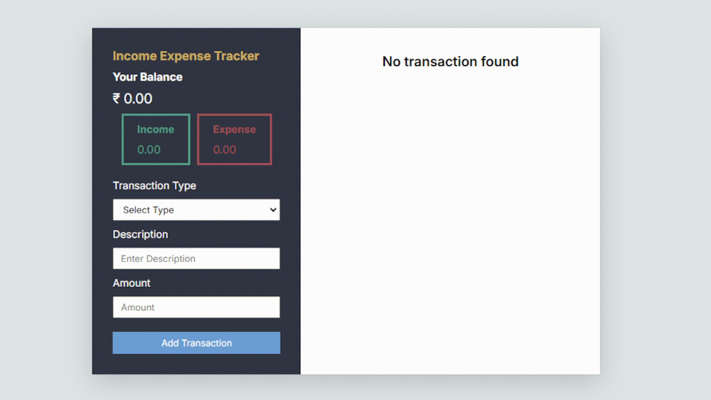

# 💸 Income-Expense Tracker

A user-friendly Income-Expense Tracker app to manage finances effortlessly. Add, edit, delete, and view transactions while tracking your balance and staying on top of your budget with ease.

## 🧩 Features

| Feature                  | Description                                                                               |
|--------------------------|-------------------------------------------------------------------------------------------|
| **Add Transaction** 📝   | Add income or expense transactions with description and amount.                           |
| **Edit Transactions** ✏️ | Update/edit your transaction details easily.                                                   |
| **Delete Transactions** 🗑️ | Remove any transaction that you no longer need.                                           |
| **Balance Calculation** 💰 | View total income, total expense, and remaining balance.                                 |

## 📷 **Preview**

## 🚀 Live Demo

Check out the live version of the app here: [Live Demo](https://github.com/shoaibhussain12/Income_expense_trackershoaibhussainkhan)

## 💻 **Tech Stack**

- 🛠️ **HTML**: Application structure.
- 🎨 **CSS**: Responsive and stylish UI.
- ⚙️ **JavaScript**: Interactive functionality and dynamic updates.
- 📂 **Local Storage**: Persistent data storage.

## 🛠️ How to Use

## ➕ Add a Transaction:
1. **Select** "Income" or "Expense" from the dropdown.
2. **Enter** the description and amount.
3. **Click** "Add" to save the transaction.

---

## ✏️ Edit a Transaction:
1. **Click** the Edit button beside the transaction.
2. **Update** the details in the modal.
3. **Click** "Update" to save changes.

---

## 🗑️ Delete a Transaction:
1. **Click** the Delete button beside the transaction.
2. **Confirm** the deletion in the popup.

---
## 📊 View Balances:
- **Monitor** your Total Income, Expenses, and Net Balance at the top of the interface.

---

👨‍💻 Made with 💖 by <a href="https://www.linkedin.com/in/shoaib-hussainkhan/">Shoaib Hussain Khan</a>
